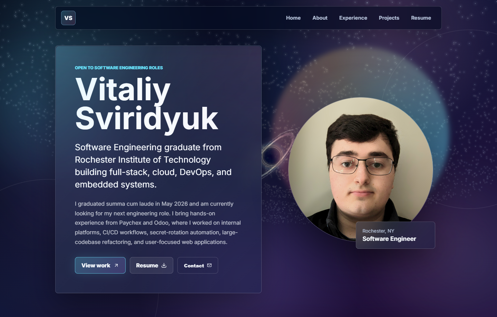

# Vitaliy Sviridyuk Portfolio

[](https://veathen.github.io/Portfolio)

Personal portfolio site for showcasing my software engineering experience, projects, resume, and contact links. The current version uses Vite, React, and a declarative React Three Fiber galaxy background.

Live site: [veathen.github.io/Portfolio](https://veathen.github.io/Portfolio)

## Highlights

- Animated React Three Fiber galaxy with a black-hole focal point and scroll-reactive motion
- Glassmorphic single-page layout for about, experience, projects, and resume sections
- Updated post-graduation copy and current resume download
- Featured senior project assets, including the AI Legacy Code Converter logo and poster PDF
- GitHub Pages deployment support through `gh-pages`

## Tech Stack

- React 19
- React Three Fiber
- CSS3
- React Icons
- Vite
- GitHub Pages

## Local Setup

Install dependencies:

```bash
npm install
```

Run the development server:

```bash
npm run dev
```

The app is configured for the `/Portfolio` base path. Locally, open:

[http://localhost:5173/Portfolio/](http://localhost:5173/Portfolio/)

## Build And Deploy

Create a production build:

```bash
npm run build
```

Deploy to GitHub Pages:

```bash
npm run deploy
```
